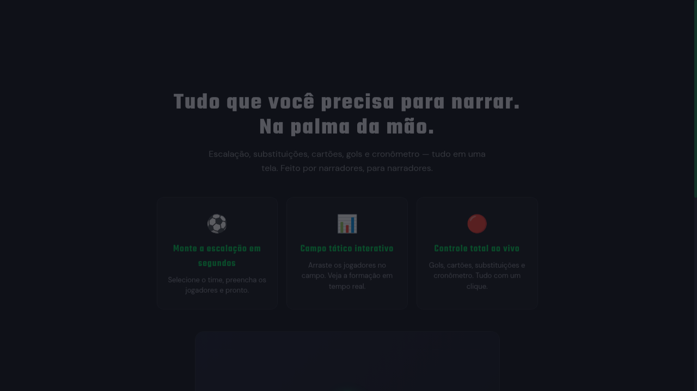

# 🎙️ VOZ DO JOGO

> Ferramenta profissional para narradores esportivos. Tudo que você precisa para narrar uma partida — escalação, substituições, cartões, gols e cronômetro — em uma única tela.

🌐 **Site:** [vozdojogo.app.br](https://vozdojogo.app.br)
🎬 **Demo pública (sem cadastro):** [vozdojogo.app.br/demo](https://vozdojogo.app.br/demo)

---

## 📸 Screenshots

### Landing page


### Dashboard — Escalação


---

## ✨ Funcionalidades

- **📋 Escalação rápida** — selecione os times, preencha os jogadores e está pronto para narrar.
- **⚽ Campo tático interativo** — arraste jogadores na formação e visualize a escalação em tempo real.
- **🔴 Modo Ao Vivo** — registre gols, cartões, substituições e controle o cronômetro com um clique.
- **📝 Notas da partida** — anote informações relevantes antes e durante o jogo.
- **📡 Tela espelhada** — compartilhe o placar via QR Code/link com colegas de transmissão.
- **🛡️ Times personalizados** — crie e salve times customizados com escudo, cores e elenco próprio.
- **💾 Escalações salvas** — reutilize escalações entre partidas sem precisar redigitar.
- **🔍 Busca de elenco real** — integração com API-Football para puxar elencos atualizados automaticamente.

---

## 🧱 Stack

**Frontend**
- ⚛️ React 18 + TypeScript 5
- ⚡ Vite 5
- 🎨 Tailwind CSS 3 + shadcn/ui
- 🛣️ React Router 6
- 🧪 Vitest

**Backend (Lovable Cloud / Supabase)**
- 🔐 Supabase Auth (e-mail + senha)
- 🗄️ Postgres com Row-Level Security
- ⚡ Edge Functions (Deno) para integração com Stripe e API-Football
- 📡 Supabase Realtime para a tela espelhada ao vivo

**Pagamentos**
- 💳 Stripe Checkout + Customer Portal + Webhooks
- 🔁 Período de carência configurável para falhas de pagamento

---

## 🏗️ Arquitetura

```
src/
├── components/         # UI (Setup, Live, Notes, Viewer, Settings, etc.)
│   ├── onboarding/     # Fluxo de qualificação + checkout + criação de conta
│   └── ui/             # shadcn primitives
├── context/            # AuthContext, SubscriptionContext, AppContext, OnboardingContext
├── data/               # Tipos, formações, store local, integração API-Football
├── hooks/              # useCustomTeams, useSavedLineups, useTeamLogo, etc.
└── integrations/
    └── supabase/       # Cliente + tipos auto-gerados

supabase/
└── functions/
    ├── check-subscription/        # Valida acesso (com período de carência)
    ├── create-checkout/           # Checkout para usuários autenticados
    ├── create-onboarding-checkout/# Checkout antes do cadastro (fluxo onboarding)
    ├── customer-portal/           # Portal Stripe para gerir assinatura
    ├── retrieve-checkout-email/   # Recupera e-mail pago para preencher cadastro
    ├── stripe-webhook/            # Sincroniza eventos de billing
    ├── link-billing-user/         # Vincula auth.user a billing_customer
    └── fetch-squad/               # Proxy para API-Football
```

### Fluxo de acesso

1. Usuário visita a landing → passa pelo **onboarding de qualificação**
2. Faz **checkout no Stripe** (assinatura mensal)
3. Após pagamento, é redirecionado para **criar conta** com o mesmo e-mail do checkout
4. O `SubscriptionGate` valida o status via edge function `check-subscription` antes de liberar o dashboard
5. Webhooks da Stripe mantêm o status de assinatura sincronizado em tempo real

> A criação de contas públicas é bloqueada — só usuários com pagamento confirmado podem se cadastrar.

---

## 🚀 Como rodar localmente

### Pré-requisitos
- Node.js 18+
- npm, pnpm ou bun

### Instalação

```bash
# clone
git clone <SEU_REPO_URL>
cd voz-do-jogo

# instale as dependências
npm install

# rode o dev server
npm run dev
```

A app abre em `http://localhost:5173`.

### Variáveis de ambiente

O arquivo `.env` é gerenciado automaticamente pelo Lovable Cloud e contém:

```
VITE_SUPABASE_URL=...
VITE_SUPABASE_PUBLISHABLE_KEY=...
VITE_SUPABASE_PROJECT_ID=...
```

Para testes locais com backend próprio, configure essas variáveis apontando para o seu projeto Supabase.

### Scripts

```bash
npm run dev       # dev server com HMR
npm run build     # build de produção
npm run preview   # preview do build
npm run test      # roda os testes (Vitest)
npm run lint      # ESLint
```

---

## 🧪 Modo demo

Para apresentar o produto sem precisar criar conta nem pagar, acesse:

```
/demo
```

Essa rota libera o dashboard completo com dados mockados em `localStorage`. Ideal para demos, testes e revisões.

---

## 🔒 Segurança

- Todas as tabelas usam **Row-Level Security (RLS)**
- Roles armazenadas em tabela separada (`user_roles`) com função `has_role` `SECURITY DEFINER`
- Webhooks da Stripe validam assinatura via `STRIPE_WEBHOOK_SECRET`
- Chaves privadas (Stripe, API-Football) armazenadas como secrets — nunca no código

---

## 📄 Licença

Projeto proprietário © Voz do Jogo. Todos os direitos reservados.

---

## 🛠️ Desenvolvido com [Lovable](https://lovable.dev)

Este projeto foi criado e é mantido com Lovable. Edições feitas aqui sincronizam automaticamente com o GitHub e vice-versa.
